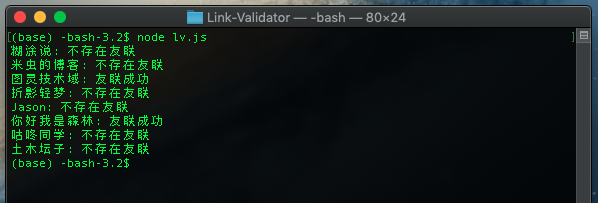

# Link-Validator

一个检测对方网站友情链接页面是否添加自己网站链接的JavaScript脚本。

运行后检测效果图：




## 作者

- [@bosichong](https://github.com/bosichong)


## 技术栈

JavaScript 原生代码，node环境(18+)下即可运行。

原理：采集对方的友情链接页面，搜索自己的网址是否存在即可验证友联是否存在。


## 在本地运行

Clone 这个 project

```bash
  git clone https://link-to-project
```

前往项目目录

```bash
  cd my-project
```
编辑`lv.js`文件，添加修改头部的'links'，把需要检测的友情链接页面加入，
修改`siteUrl = 'suiyan.cc'`为你自己的网址。

格式如下：

```
let siteUrl = 'suiyan.cc'
let links = [
    {
        site: "碎言博客",
        ulr: "https://suiyan.cc/aboutme.html"
    },
    {
        site: "糊涂说",
        ulr: "https://hutusi.com/links/"
    },
    {
        site: "Jason",
        ulr: "http://atjason.com/links/"
    },
    {
        site: "咕咚同学",
        ulr: "https://gudong.site/links.html"
    }
];
```

启动服务器

```bash
  node lv.js
```


## 🚀 关于
写这个脚本是为了方便检测我的博客友联状况，那么有没有独立博客的小伙伴互换个链接呢？

我的博客：碎言博客

链接：[https://suiyan.cc/](https://suiyan.cc/)


## 致谢

- [非常棒的 Readme 模板](https://awesomeopensource.com/project/elangosundar/awesome-README-templates)
- [非常棒的 README](https://github.com/matiassingers/awesome-readme)
- [如何写好 readme](https://bulldogjob.com/news/449-how-to-write-a-good-readme-for-your-github-project)

